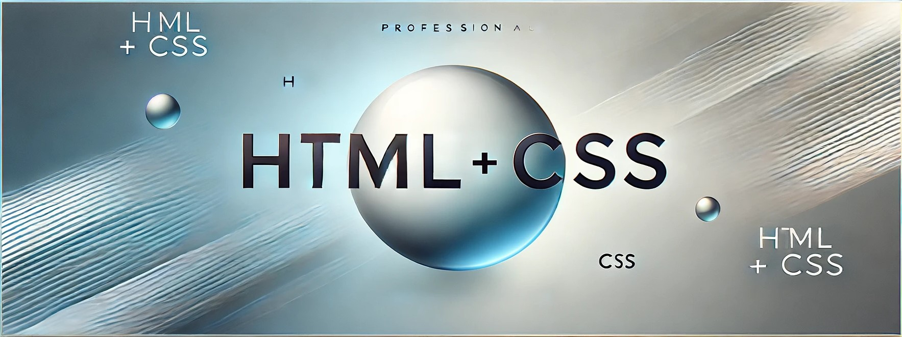

## ABOUT THIS PROJECT 🚀

This project is made with HTML and CSS where the main focus is on practicing the layout of a responsive web page with different browser default themes. It also includes image optimization, video controls, and various types of animations and transitions.


## REQUIREMENTS

- [Visual Studio Code](https://code.visualstudio.com/)


## INSTALLATION 🔧
Download project

```bash
  git clone https://github.com/cristina16z/Restaurant_LandingPage.git
```
\
Join into the project
```bash
  cd Restaurant_LandingPage
```


## TECH STACK

**Language:**  Html and CSS


## AUTHORS ✒️
*[@Cristina16z](https://github.com/cristina16z)*


